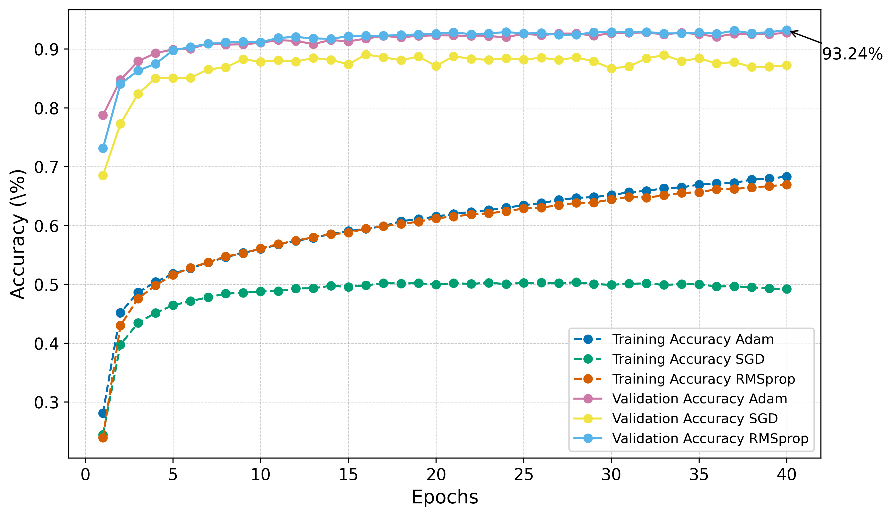
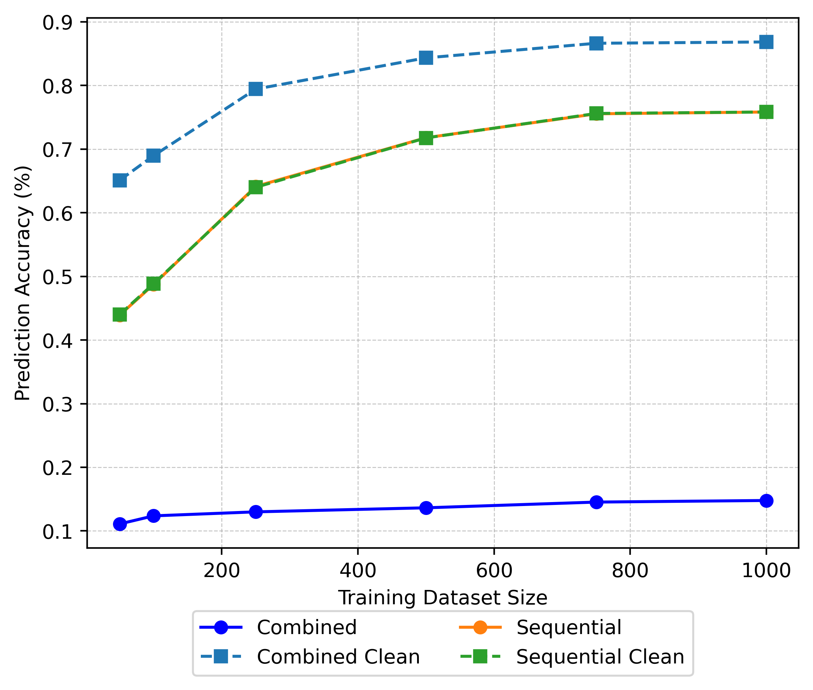

# Learning to Add Handwritten Digits with MNIST

A PyTorch study of predicting the sum of two handwritten digits directly from their images. The project compares fully connected neural networks with classical classifiers and explores how architecture, optimisation, augmentation, and task decomposition affect performance.

**Recorded result:** the saved 40-epoch RMSprop experiment reports **93.38% test accuracy** on the project's paired-digit split. These are historical notebook outputs, not a newly reproduced benchmark.

## Task and approach

Two 28 × 28 MNIST images are concatenated into a 56 × 28 image and labelled with their sum (0–18). Both digit orders are included. The workflow combines the original MNIST training and test collections, randomly pairs digits, and creates a custom 60%/20%/20% training/validation/test split. These scores therefore do not use the standard MNIST test protocol.

- **Neural network:** flattened 1,568-pixel input, configurable fully connected layers, activation, dropout, and layer-width decay. The implementation uses 20 output logits, although only sums 0–18 occur.
- **Optimisation:** Adam, SGD, and RMSprop comparisons, with Optuna searches over network and training parameters.
- **Augmentation:** rotations, affine transforms, random erasing, Gaussian noise, and salt-and-pepper noise applied to training images.
- **Classical methods:** random forest, support vector machine, logistic regression, k-nearest neighbours, and gradient boosting experiments.
- **Task decomposition:** compare predicting a sum directly with classifying each digit separately and adding the predictions.

## Recorded results

Selected outputs from [the main experiment notebook](MNIST_addition_dev.ipynb):

| Experiment | Recorded test accuracy |
|---|---:|
| Fully connected network, Adam, 40 epochs | 92.79% |
| Fully connected network, SGD, 40 epochs | 87.89% |
| Fully connected network, RMSprop, 40 epochs | 93.38% |
| Logistic regression, direct sum prediction, clean images | 21.19% |
| Logistic regression, separate digit predictions then addition, clean images | 86.26% |

The network results are in the optimiser-comparison section; the logistic-regression results are in Part VI. The two logistic-regression runs reached their iteration limit and emitted convergence warnings. The sequential experiment constructs its own digit pairs, so the table describes the saved experiments rather than a controlled leaderboard on identical inputs. Other classical classifiers are explored, but complete comparable test scores are not recorded for every method.





## Repository guide

| Path | Contents |
|---|---|
| [MNIST_addition_dev.ipynb](MNIST_addition_dev.ipynb) | Main experiment narrative, saved outputs, classifier comparisons, and embedding visualisations |
| [src/model.py](src/model.py) | Configurable fully connected PyTorch network |
| [src/training.py](src/training.py) | Training, evaluation, and optimisation helpers |
| [src/utils_func.py](src/utils_func.py) | Pair generation, splitting, augmentation, and data conversion |
| [notebooks/](notebooks/) | Supporting experiments, plotting notebook, and saved CSV results |
| [plots/](plots/) | Exported learning curves |
| [models/](models/) | Saved model checkpoints |
| [data/MNIST/raw/](data/MNIST/raw/) | MNIST data files |
| [M1_Coursework.pdf](M1_Coursework.pdf) | Coursework brief |

## Explore locally

The original notebook records Python 3.8.0. The pinned requirements capture that historical environment, including PyTorch 2.2.2 and torchvision 0.17.2; compatibility with newer Python versions and other platforms has not been verified.

```bash
git clone https://github.com/S-Nazem/MNIST_addition.git
cd MNIST_addition
python3 -m venv .venv
source .venv/bin/activate
python -m pip install -r requirements.txt
jupyter notebook MNIST_addition_dev.ipynb
```

Start with the saved outputs in the main notebook. For reruns, work through the relevant experiment sections in order and check paths for data, CSVs, and checkpoints. Training and hyperparameter sweeps can be expensive.

## Reproducibility notes

This is an exploratory coursework repository. Some training cells are disabled inside multiline strings, downstream plotting cells depend on earlier session state, and some supporting notebooks are unfinished. A fresh “Run All” is not a validated reproduction route. Random pairing and augmentation also mean reruns can differ unless seeds and splits are fixed.

The data-loading code contains a legacy SSL-verification override. Use the bundled data where possible and restore normal certificate verification before downloading data in a new environment.
